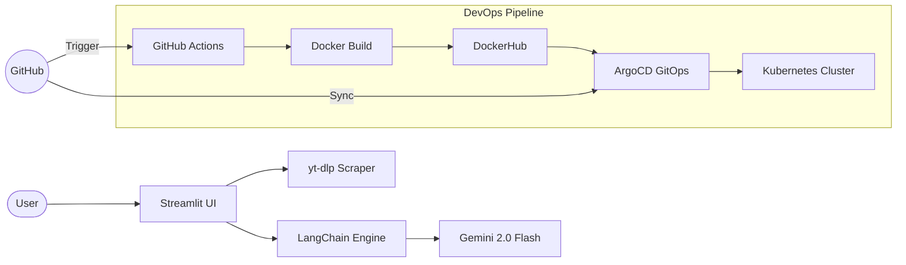

# 🚀 TubeRank AI: Enterprise YouTube SEO (Gemini & LangChain Powered)

[](https://youtube-seo-insights-generator-using-jenkins-argocd-kubernetes.streamlit.app/)
[](https://www.python.org/)
[](https://streamlit.io/)
[](https://langchain.com/)
[](https://deepmind.google/technologies/gemini/)
[](https://kubernetes.io/)
[](https://argoproj.github.io/cd/)

**[🔗 Access the Live Web App Here](https://youtube-seo-insights-generator-using-jenkins-argocd-kubernetes.streamlit.app/)**

TubeRank AI is a professional-grade SEO engine designed to give creators a competitive edge. Built on a full Enterprise DevOps stack, it leverages **LangChain** and **Gemini 2.0 Flash** to generate viral metadata, analyze niche competition, and craft disruptive "contrarian" hooks based on real-world data.

---

## 🌟 Cutting-Edge Features

### 📊 1. Real-Data Niche Saturation Score
Unlike standard AI tools that "guess," TubeRank AI performs a **live YouTube search** for your topic, analyzes the top 15 results, and computes a competition score (1-10) based on actual average view counts.
- **Reliability:** 🟢 Live YouTube Data (via yt-dlp).
- **Insight:** Highlights whether to proceed, niche down, or pivot based on competitor strength.

### 🎭 2. Contrarian Hook Generator
Generate titles that deliberately challenge the dominant angle in your niche to boost CTR.
- **Mathematical Validation:** Every hook is scored using **Jaccard Word Divergence** (1-10) against the top competitor.
- **Logic:** High scores (8+) indicate maximum conceptual contrast, triggering the "Pattern Interrupt" effect in viewers.

### 🧠 3. Advanced LangChain Engine
- **JSON Native Mode**: Powered by `PydanticOutputParser` for guaranteed 100% structured output.
- **Recursive Splitting**: Intelligently handles scripts and transcripts up to **25,000+ characters** using automated NLP chunking.
- **Hinglish Optimization**: Specifically tuned for the Indian creator market (Conversational Hindi-English mix).

### 🌓 4. Premium Adaptive UX
- **Dynamic Theming**: Features a built-in **Light/Dark mode** toggle with a premium Glassmorphism aesthetic.
- **Responsive Layout**: Optimized for 100% screen resolution with high-contrast, professional typography.

---

## 🏗️ Enterprise Infrastructure

- **Containerization**: 🐳 Dockerized for environment parity.
- **Orchestration**: ☸️ Kubernetes (K8s) for self-healing and zero-downtime rolling updates.
- **CI Pipeline**: 🏗️ **GitHub Actions** automation for linting, testing, and building images.
- **CD/GitOps**: 🐙 **ArgoCD** for automated synchronization between GitHub manifests and the live cluster.

---

## 🛠️ Tech Stack

- **Frontend**: Streamlit (Premium Adaptive UI)
- **AI Framework**: LangChain
- **AI Model**: Google Gemini 2.0 Flash
- **Scraper**: yt-dlp (Bypasses standard bot protection)
- **Metrics**: Jaccard Similarity / Set Theory Divergence
- **Infrastructure**: Docker, Kubernetes, GitHub Actions, ArgoCD

---

## 📐 Architecture Diagram



---

## 🚀 Getting Started

### 1. Prerequisites
- Python 3.11+
- [Google AI Studio](https://aistudio.google.com/app/apikey) API Key.

### 2. Installation
```bash
git clone https://github.com/Shoury22a/YouTube-SEO-Insights-Generator-using-Jenkins-ArgoCD-Kubernetes.git
cd YouTube-SEO-Insights-Generator-using-Jenkins-ArgoCD-Kubernetes
pip install -r requirements.txt
```

### 3. Configuration
Add your key to a `.env` file:
```env
GOOGLE_API_KEY=your_api_key_here
```

### 4. Running Locally
```bash
streamlit run app.py
```

---

## 🤝 Contributing
Contributions are welcome! Please feel free to submit a Pull Request.

## 📄 License
Distributed under the MIT License.
