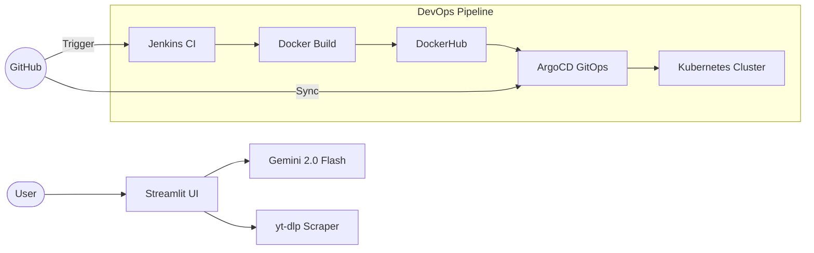

# 🚀 YouTube SEO Insights Generator (Enterprise Edition)

[](https://www.python.org/)
[](https://streamlit.io/)
[](https://deepmind.google/technologies/gemini/)
[](https://kubernetes.io/)
[](https://argoproj.github.io/cd/)

A professional-grade YouTube SEO tool that generates viral-ready metadata using Google's **Gemini 2.0 Flash**. Designed for high scalability and zero-downtime using a full Enterprise DevOps stack.

---

## 🌟 Key Features

### 🧠 Advanced AI Engine
- **Gemini 2.0 Flash Backend**: High-speed, high-quality generation at zero cost.
- **JSON Native Mode**: Guarantees structured output for titles, tags, and descriptions.
- **Hinglish Support**: Specifically tuned for the Indian creator market, generating conversational Hindi-English mix in Roman script.
- **Smart Summarization**: Handles transcripts up to 25k characters using an automated summarization pipeline.

### 🔍 Robust Competitor Intelligence
- **yt-dlp Integration**: Replaced fragile BeautifulSoup scraping with an industry-standard engine to bypass YouTube's latest bot protections.
- **Keyword Gap Analysis**: AI analyzes competitor metadata to identify hooks and trending keywords.

### 🏗️ Enterprise DevOps Infrastructure
- **Dockerized**: Consistent execution across all environments.
- **Kubernetes Orchestration**: Features self-healing, scaling, and rolling updates for zero downtime.
- **CI/CD via Jenkins**: Automated linting, building, and pushing of images.
- **GitOps with ArgoCD**: Synchronizes your GitHub repository's `k8s/` manifests with the live cluster.

---

## 🛠️ Tech Stack

- **Frontend**: Streamlit
- **AI Backend**: Google Generative AI (Gemini 2.0 Flash)
- **Scraper**: yt-dlp
- **CI/CD**: Jenkins, DockerHub
- **Orchestration**: Kubernetes (K8s), ArgoCD

---

## 📐 Architecture Diagram



---

## 🚀 Getting Started

### 1. Prerequisites
- Python 3.11+
- Docker & Kubernetes (Desktop or Minikube)
- A [Google AI Studio](https://aistudio.google.com/app/apikey) API Key.

### 2. Installation
```bash
git clone https://github.com/Shoury22a/YouTube-SEO-Insights-Generator-using-Jenkins-ArgoCD-Kubernetes.git
cd YouTube-SEO-Insights-Generator-using-Jenkins-ArgoCD-Kubernetes
pip install -r requirements.txt
```

### 3. Configuration
Create a `.env` file in the root directory:
```env
GOOGLE_API_KEY=your_api_key_here
```

### 4. Running Locally
```bash
streamlit run app.py
```

---

## ☸️ Kubernetes Deployment

Deploy securely to your local cluster:

1. Create the API secret:
   ```bash
   kubectl create secret generic youtube-seo-secrets --from-literal=google-api-key="your_key"
   ```

2. Apply the manifests:
   ```bash
   kubectl apply -f k8s/
   ```

3. Access the app at: **http://localhost**

---

## 🤝 Contributing
Contributions are welcome! Please feel free to submit a Pull Request.

## 📄 License
Distributed under the MIT License. See `LICENSE` for more information.
