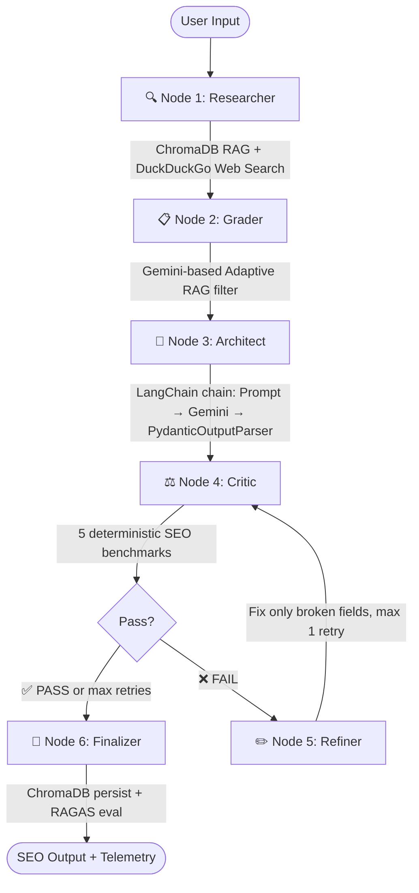
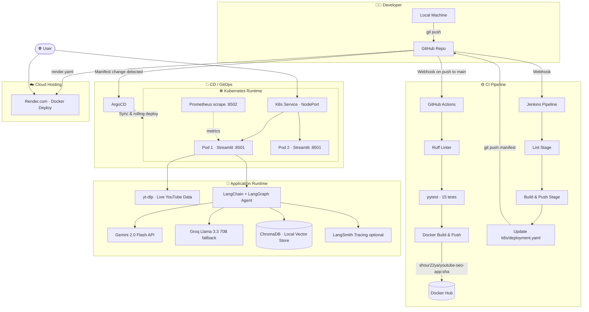

# 🚀 TubeRank AI: Enterprise YouTube SEO Insights Generator

[](https://www.python.org/)
[](https://streamlit.io/)
[](https://langchain.com/)
[](https://langchain-ai.github.io/langgraph/)
[](https://deepmind.google/technologies/gemini/)
[](https://groq.com/)
[](https://www.trychroma.com/)
[](https://www.jenkins.io/)
[](https://kubernetes.io/)
[](https://argoproj.github.io/cd/)

TubeRank AI is a professional-grade YouTube SEO engine with a full **enterprise MLOps stack**. It combines a multi-model AI pipeline (Gemini 2.0 Flash + Groq Llama 3.3 fallback), a 6-node LangGraph agentic workflow, a ChromaDB semantic memory store, real-time YouTube niche analysis, and Prometheus observability — all deployed via Jenkins → Docker Hub → ArgoCD → Kubernetes.

---

## 🌟 Features

| Feature | Description |
|---|---|
| 🧠 **Agentic SEO Pipeline** | 6-node LangGraph state machine: Researcher → Grader → Architect → Critic → Refiner → Finalizer |
| 🔁 **Multi-Model Fallback** | Rotates across multiple Gemini 2.0/Pro/Flash-Lite keys; ultimate fallback to Groq Llama 3.3 70B |
| 💾 **Semantic RAG Memory** | ChromaDB + `text-embedding-004` stores all past generations for context-aware future requests |
| 📊 **Live Niche Saturation** | Real YouTube search via `yt-dlp` — scores competition 1-10 based on actual competitor view counts |
| 🎭 **Contrarian Hook Generator** | Jaccard Word Divergence scoring (1-10) measures how much a hook deviates from the dominant angle |
| 📝 **Structured Output** | `PydanticOutputParser` guarantees 100% valid JSON from every LLM call — no hallucinated fields |
| 📄 **Long Transcript Handling** | `RecursiveCharacterTextSplitter` + Map-Reduce summarization for transcripts up to 25,000+ chars |
| 🌐 **Adaptive RAG Grading** | DuckDuckGo web search + Gemini-based relevance grader filters out stale RAG documents |
| 📈 **RAGAS Evaluation** | Optional faithfulness, answer relevancy, context precision & recall scoring of the RAG pipeline |
| 🔭 **Prometheus Observability** | Custom metrics (latency, retries, RAGAS scores, RAG counts) scraped at port 8502 |
| 🕵️ **LangSmith Tracing** | Full LangChain/LangGraph execution traces when `LANGCHAIN_TRACING_V2=true` |
| 🌓 **Adaptive Dark/Light UI** | Glassmorphism Streamlit UI with History page (`pages/history.py`) |
| 📥 **PDF Export** | Downloadable SEO report via `fpdf2` |

---

## 🏗️ Code Architecture

### Module Map

```
├── app.py                  # Streamlit UI entry-point (main generation page)
├── pages/
│   └── history.py          # Streamlit multi-page — past generations browser
├── src/
│   ├── ai_model.py         # LangChain LLM pipeline, Pydantic schema, fallback chain builder
│   ├── agent.py            # LangGraph 6-node agentic workflow (SEO Strategist)
│   ├── rag_store.py        # ChromaDB vector store — persist & retrieve past generations
│   ├── rag_evaluator.py    # RAGAS evaluation (Faithfulness, Relevancy, Precision, Recall)
│   ├── extractor.py        # yt-dlp scraper: video metadata, niche saturation, Jaccard scoring
│   ├── metrics.py          # Prometheus metrics (Histogram, Counter, Gauge) on port 8502
│   ├── pdf_exporter.py     # fpdf2 PDF report builder
│   ├── title_scorer.py     # Rule-based title quality scorer & report card
│   ├── thumbnail_gen.py    # Thumbnail concept generator (Gemini vision)
│   ├── token_budget.py     # Daily token usage tracker with budget limits
│   ├── exception.py        # Custom exception hierarchy (APIException, ValidationException)
│   └── logger.py           # Rotating file + console logger
├── tests/
│   └── test_langchain_integration.py  # 15 pytest unit tests (mocked, no real API calls)
├── k8s/
│   ├── deployment.yaml     # K8s Deployment (2 replicas, Prometheus annotations, health probes)
│   ├── service.yaml        # K8s Service (NodePort)
│   ├── application.yaml    # ArgoCD Application manifest (GitOps sync target)
│   └── jenkins-setup.yaml  # Jenkins K8s deployment manifest
├── .github/workflows/
│   └── deploy.yml          # GitHub Actions CI: Lint (Ruff) → Test (pytest) → Docker build & push
├── Jenkinsfile             # Jenkins Pipeline: Checkout → Lint → Build → Push → GitOps update
├── Dockerfile              # python:3.11-slim, ffmpeg, pip install, streamlit run
└── render.yaml             # Render.com deployment config (Docker env, free plan)
```

---

### 🤖 Agentic Workflow (LangGraph — `src/agent.py`)

The agentic pipeline is a **compiled LangGraph state machine** with 6 nodes and conditional edges:


```mermaid
graph TD
    A([User Input]) --> B[🔍 Node 1: Researcher]
    B --> |ChromaDB RAG + DuckDuckGo Web Search| C[📋 Node 2: Grader]
    C --> |Gemini-based Adaptive RAG filter| D[🧠 Node 3: Architect]
    D --> |LangChain chain: Prompt → Gemini → PydanticOutputParser| E[⚖️ Node 4: Critic]
    E --> |5 deterministic SEO benchmarks| F{Pass?}
    F --> |✅ PASS or max retries| G[💾 Node 6: Finalizer]
    F --> |❌ FAIL| H[✏️ Node 5: Refiner]
    H --> |Fix only broken fields, max 1 retry| E
    G --> |ChromaDB persist + RAGAS eval| I([SEO Output + Telemetry])
```

**Critic benchmarks checked on every draft:**
1. Title length (≤70 chars for long-form, ≤45 for Shorts)
2. Total tag character count (≤500 chars)
3. Core keyword presence in at least one title
4. Description word count (100–500 words)
5. All required fields present (titles, description, tags, social_posts, thumbnail_ideas)

**Fallback:** If the agent fails for any reason, `generate_seo_metadata_agentic()` in `ai_model.py` automatically falls back to the linear pipeline and still persists the result to RAG.

---

### 🔗 LangChain Linear Pipeline (`src/ai_model.py`)

```
Topic + Audience + [Transcript] + [RAG Context]
        │
        ▼
_build_llm_with_fallback()
  ├─ Gemini 2.0 Flash  (Key 1)
  ├─ Gemini Flash-Latest (Key 1)
  ├─ Gemini Pro-Latest (Key 1)
  ├─ [Repeat for Key 2, Key 3 ...]
  └─ Groq Llama 3.3 70B (GROQ_API_KEY, lazy optional import)
        │
        ▼
ChatPromptTemplate (System + Human)
        │
        ▼
LLM chain with .with_fallbacks()
        │
        ▼
PydanticOutputParser → SEOOutput (validated, typed)
        │
        ▼
persist_generation() → ChromaDB
```

---

### 🗄️ RAG Memory Store (`src/rag_store.py`)

- **Vector DB:** ChromaDB (local persistent, collection: `seo_generations`)
- **Embedding model:** `models/text-embedding-004` via `GoogleGenerativeAIEmbeddings`
- **On every generation:** Topic, titles, tags, and description are embedded and stored
- **On next request:** Top-k semantically similar past generations are retrieved and injected as context
- **Adaptive RAG Grading (Node 2):** Gemini LLM scores each retrieved doc's relevance before use; keyword-overlap fallback if LLM call fails

---

## 🏛️ Full System Architecture (DevOps + Runtime)


```mermaid
graph TD
    subgraph Developer["👨‍💻 Developer"]
        DEV[Local Machine] -->|git push| GH[GitHub Repo]
    end

    subgraph CI["⚙️ CI Pipeline"]
        GH -->|Webhook on push to main| GHA[GitHub Actions]
        GHA --> LINT[Ruff Linter]
        LINT --> TEST[pytest · 15 tests]
        TEST --> BUILD[Docker Build & Push]
        BUILD -->|shour22ya/youtube-seo-app:sha| DH[(Docker Hub)]
        GH -->|Webhook| JEN[Jenkins Pipeline]
        JEN --> JLINT[Lint Stage]
        JLINT --> JBUILD[Build & Push Stage]
        JBUILD --> JGITOPS[Update k8s/deployment.yaml]
        JGITOPS -->|git push manifest| GH
    end

    subgraph CD["🚀 CD / GitOps"]
        GH -->|Manifest change detected| ARGO[ArgoCD]
        ARGO -->|Sync & rolling deploy| K8S[Kubernetes Cluster]
    end

    subgraph K8S["☸️ Kubernetes Runtime"]
        POD1[Pod 1 · Streamlit :8501] 
        POD2[Pod 2 · Streamlit :8501]
        SVC[K8s Service · NodePort]
        PROM[Prometheus scrape :8502]
        SVC --> POD1
        SVC --> POD2
        PROM -.->|metrics| POD1
    end

    subgraph APP["🧠 Application Runtime"]
        POD1 --> YDLP[yt-dlp · Live YouTube Data]
        POD1 --> LC[LangChain + LangGraph Agent]
        LC --> GEM[Gemini 2.0 Flash API]
        LC --> GROQ[Groq Llama 3.3 70B fallback]
        LC --> CHROMA[(ChromaDB · Local Vector Store)]
        LC --> LS[LangSmith Tracing optional]
    end

    subgraph CLOUD["☁️ Cloud Hosting"]
        GH -->|render.yaml| RENDER[Render.com · Docker Deploy]
    end

    USER([🌐 User]) --> SVC
    USER --> RENDER
```

---

## 🛠️ Tech Stack

| Layer | Technology |
|---|---|
| **Frontend** | Streamlit 1.41.1 (multi-page: Main + History) |
| **AI Framework** | LangChain ≥0.3, LangGraph ≥0.2 |
| **Primary LLM** | Google Gemini 2.0 Flash (`gemini-2.0-flash`) |
| **Fallback LLM** | Groq Llama 3.3 70B Versatile (lazy optional) |
| **Embeddings** | Google `text-embedding-004` |
| **Vector DB** | ChromaDB ≥0.5 (local persistent) |
| **RAG Evaluation** | RAGAS ≥0.2 (Faithfulness, Relevancy, Precision, Recall) |
| **Observability** | Prometheus Client (custom metrics, port 8502) + LangSmith |
| **YouTube Scraper** | yt-dlp 2025.01.26 |
| **Web Search** | DuckDuckGo Search ≥6.0 |
| **Output Parsing** | Pydantic ≥2.0 (`PydanticOutputParser`) |
| **PDF Export** | fpdf2 ≥2.8 |
| **Containerization** | Docker (python:3.11-slim + ffmpeg) |
| **Orchestration** | Kubernetes (2 replicas, liveness/readiness probes) |
| **CI** | GitHub Actions (Ruff lint → pytest → Docker push) + Jenkins |
| **CD/GitOps** | ArgoCD (tracks `k8s/` manifests in this repo) |
| **Cloud Deploy** | Render.com (Docker env, `render.yaml`) |
| **Tracing** | LangSmith (auto-enabled via `LANGCHAIN_TRACING_V2=true`) |

---

## 🚀 Getting Started

### 1. Prerequisites
- Python 3.11+
- [Google AI Studio](https://aistudio.google.com/app/apikey) API Key
- (Optional) [Groq API Key](https://console.groq.com/) for fallback LLM

### 2. Installation
```bash
git clone https://github.com/Shoury22a/YouTube-SEO-Insights-Generator-using-Jenkins-ArgoCD-Kubernetes.git
cd YouTube-SEO-Insights-Generator-using-Jenkins-ArgoCD-Kubernetes
pip install -r requirements.txt
```

### 3. Configuration
Create a `.env` file (see `.env.example` for all options):
```env
# Required
GOOGLE_API_KEY=your_primary_gemini_key

# Optional — increases capacity with key rotation
GOOGLE_API_KEY_2=your_second_key
GOOGLE_API_KEY_3=your_third_key

# Optional — Groq fallback LLM (Llama 3.3 70B)
GROQ_API_KEY=your_groq_key

# Optional — LangSmith tracing
LANGCHAIN_TRACING_V2=true
LANGCHAIN_API_KEY=your_langsmith_key
LANGCHAIN_PROJECT=tuberank-ai
```

### 4. Run Locally
```bash
streamlit run app.py
```

### 5. Run Tests
```bash
pytest tests/ -v
```

---

## 🤝 Contributing
Contributions are welcome! Please feel free to submit a Pull Request.

## 📄 License
Distributed under the MIT License.
